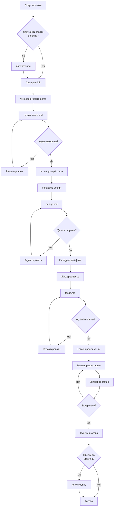
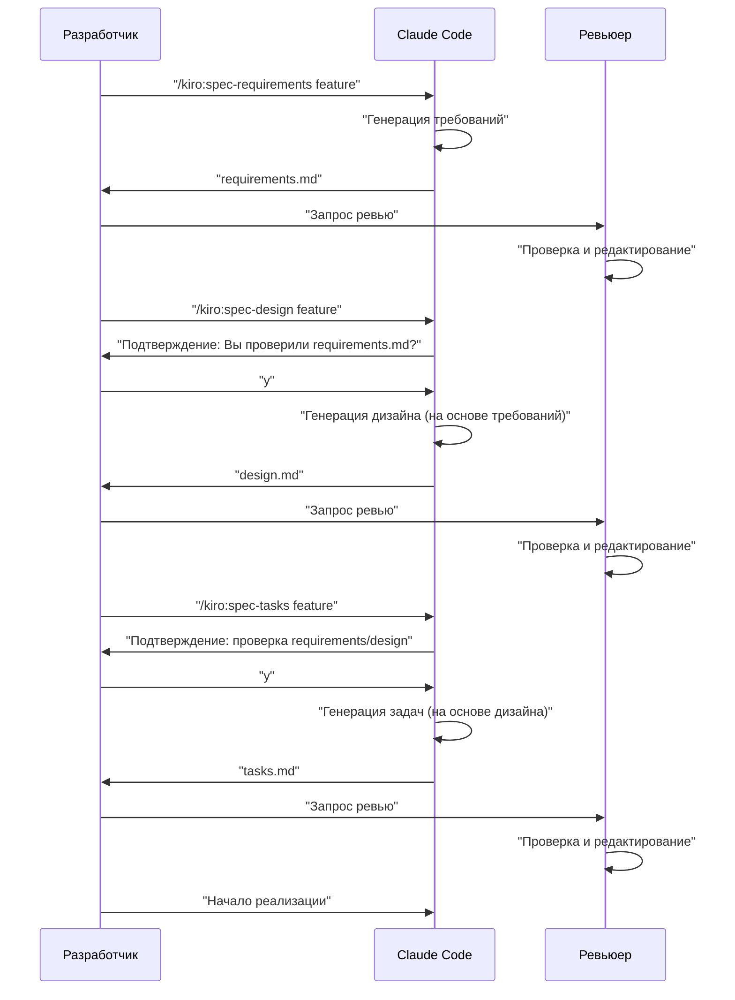

# Мультиплатформенная Spec-Driven разработка

> ⚠️ **Архивная документация.** Эта страница отражает ранний workflow cc-sdd и сохранена для справки. Актуальные инструкции см. в [текущем README](../../README.md).

> 🌐 **Язык**  
> 📖 **[English](README_en.md)** | 📖 **[日本語](README_ja.md)** | 📖 **[繁體中文](README_zh-TW.md)** | 📖 **Русский** (эта страница)

> 🚀 **Поддерживаемые платформы**  
> 🤖 **Claude Code** | 🔮 **Cursor** | ⚡ **Gemini CLI** | 🧠 **Codex CLI** | 🐙 **GitHub Copilot** | 🔧 **Qwen Code** | 🌊 **Windsurf**

> [!Warning]
> Это начальная версия, которая будет улучшаться по мере использования

Комплексный набор инструментов для Spec-Driven разработки, поддерживающий Claude Code, Cursor, Gemini CLI и Codex CLI. Этот проект воспроизводит workflow спецификационной разработки Kiro IDE на нескольких AI-платформах.

**Высокая совместимость с Kiro IDE** — Используйте существующие спецификации, workflows и структуру каталогов Kiro без изменений.

## Обзор

Этот проект предоставляет инструменты для эффективной Spec-Driven разработки с использованием Slash-команд на нескольких AI-платформах (Claude Code, Cursor, Gemini CLI, Codex CLI, GitHub Copilot, Qwen Code, Windsurf). Используя соответствующие команды для каждой фазы разработки, вы можете достичь систематического и качественного процесса разработки независимо от предпочитаемой платформы.

## Настройка

### Интеграция в ваш проект

Скопируйте соответствующую директорию в зависимости от вашей AI-платформы:

#### Директории для платформ
- **🤖 Claude Code**: `.claude/commands/` — определения Slash-команд
- **🧠 Codex CLI**: `.codex/prompts/` — определения промптов OpenAI Codex
- **🔮 Cursor**: `.cursor/commands/` — определения команд Cursor  
- **⚡ Gemini CLI**: `.gemini/commands/` — TOML-конфигурации
- **🐙 GitHub Copilot**: `.github/prompts/` — коллекции промптов для Copilot Chat
- **🔧 Qwen Code**: `.qwen/commands/kiro/` — slash-команды Qwen Code
- **🌊 Windsurf IDE**: `.windsurf/workflows/` — определения workflows Windsurf

#### Общие конфигурационные файлы
- **Файлы конфигурации**: Скопируйте конфиги для платформы (`CLAUDE.md`, `AGENTS.md` и т.д.) по необходимости

### Начальные шаги

1. **Выбор платформы**: Скопируйте директорию для вашей AI-среды
2. **Настройка конфигурации**: Адаптируйте конфиги под ваш проект
3. **Запустите начальные команды** (общие для всех платформ):
   ```bash
   # Опционально: Создание steering-документов
   /kiro:steering
   
   # Создание первой спецификации функции
   /kiro:spec-init "Подробное описание вашего проекта"
   ```

### Требуемая структура каталогов

При запуске команд автоматически создаются следующие директории:

```
your-project/
├── .claude/commands/kiro/     # Slash-команды Claude Code
├── .codex/prompts/            # Промпты Codex CLI
├── .cursor/commands/kiro/     # Команды Cursor
├── .gemini/commands/kiro/     # TOML-определения Gemini CLI
├── .github/prompts/           # Промпты GitHub Copilot
├── .qwen/commands/kiro/       # Slash-команды Qwen Code
├── .windsurf/workflows/       # Workflows Windsurf
├── .kiro/
│   ├── steering/              # Авто-генерируемые steering-документы
│   └── specs/                 # Авто-генерируемые спецификации  
├── CLAUDE.md                  # Основной конфиг
└── (ваши файлы проекта)
```

## Использование

### 1. Для новых проектов

```bash
# Опционально: Генерация project steering (рекомендуется)
/kiro:steering

# Шаг 1: Создание спецификации новой функции
/kiro:spec-init "Я хочу создать функцию, где пользователи могут загружать PDF, извлекать диаграммы и графики, а AI объясняет содержимое. Стек: Next.js, TypeScript, Tailwind CSS."

# Шаг 2: Определение требований
/kiro:spec-requirements pdf-diagram-extractor
# → Проверьте и отредактируйте .kiro/specs/pdf-diagram-extractor/requirements.md

# Шаг 3: Техническое проектирование (интерактивное утверждение)
/kiro:spec-design pdf-diagram-extractor
# → Ответьте на "Вы проверили requirements.md? [y/N]"
# → Проверьте и отредактируйте .kiro/specs/pdf-diagram-extractor/design.md

# Шаг 4: Генерация задач (интерактивное утверждение)
/kiro:spec-tasks pdf-diagram-extractor
# → Ответьте на подтверждение проверки требований и дизайна
# → Проверьте и отредактируйте .kiro/specs/pdf-diagram-extractor/tasks.md

# Шаг 5: Начало реализации
```

### 2. Добавление функций в существующие проекты

```bash
# Опционально: Создание или обновление steering
/kiro:steering

# Шаг 1: Создание спецификации новой функции
/kiro:spec-init "Подробное описание новой функции"
# Дальнейшие шаги такие же, как для новых проектов
```

### 3. Отслеживание прогресса

```bash
# Проверка прогресса конкретной функции
/kiro:spec-status my-feature

# Показывает текущую фазу, статус утверждения и прогресс задач
```

## Процесс Spec-Driven разработки

### Диаграмма процесса

В этом процессе каждая фаза требует "Проверки и утверждения".

**Steering-документы** — документы, содержащие постоянные знания о проекте (архитектура, стек технологий, соглашения о коде и т.д.). Их создание и обновление опционально, но рекомендуется для долгосрочной поддержки проекта.



## Справочник Slash-команд

### 🚀 Фаза 0: Project Steering (Опционально)

| Команда | Назначение | Когда использовать |
|---------|------------|-------------------|
| `/kiro:steering` | Умное создание или обновление steering-документов | Любой сценарий |
| `/kiro:steering-custom` | Создание кастомных steering-документов | Когда нужны особые соглашения |

**Примечание**: Steering-документы рекомендуются, но не обязательны. Их можно пропустить для небольших функций или экспериментальной разработки.

#### Типы Steering-документов
- **product.md**: Обзор продукта, функции, use cases
- **tech.md**: Архитектура, стек технологий, среда разработки
- **structure.md**: Структура директорий, соглашения о коде, правила именования
- **Кастомные документы**: API-соглашения, политики тестирования, политики безопасности и т.д.

### 📋 Фаза 1: Создание спецификации

| Команда | Назначение | Когда использовать |
|---------|------------|-------------------|
| `/kiro:spec-init [описание проекта]` | Инициализация структуры спецификации | При начале разработки новой функции |
| `/kiro:spec-requirements [имя-функции]` | Генерация документа требований | Сразу после инициализации спецификации |
| `/kiro:spec-design [имя-функции]` | Генерация технического дизайна | После утверждения требований |
| `/kiro:spec-tasks [имя-функции]` | Генерация задач реализации | После утверждения дизайна |

### 📊 Фаза 2: Управление прогрессом

| Команда | Назначение | Когда использовать |
|---------|------------|-------------------|
| `/kiro:spec-status [имя-функции]` | Проверка текущего прогресса и фазы | Регулярно во время разработки |

## 3-фазный Workflow утверждения

Ядро системы требует человеческой проверки и утверждения на каждой фазе:



## Лучшие практики

### ✅ Рекомендации

1. **Всегда начинайте со steering**
   - Используйте `/kiro:steering` для всех сценариев
   - Команда умно обрабатывает и создание, и обновление

2. **Не пропускайте фазы**
   - Строго следуйте порядку: Requirements → Design → Tasks
   - Обеспечьте человеческую проверку на каждой фазе

3. **Регулярно проверяйте прогресс**
   - Используйте `/kiro:spec-status` для понимания текущей ситуации
   - Обновляйте статус выполнения задач

4. **Поддерживайте steering**
   - Запускайте `/kiro:steering` после крупных изменений
   - Обновляйте по мере роста проекта

### ❌ Чего избегать

1. **Переход к следующей фазе без утверждения**
   - Не забывайте отвечать на запросы подтверждения

2. **Игнорирование steering-документов**
   - Устаревшая информация мешает разработке

3. **Не обновлять статус задач**
   - Прогресс становится неясным, управление затрудняется

## Структура проекта

```
.
├── .claude/
│   └── commands/          # Определения Slash-команд
│       └── kiro/
│           ├── spec-init.md
│           ├── spec-requirements.md
│           ├── spec-design.md
│           ├── spec-tasks.md
│           ├── spec-status.md
│           ├── steering.md
│           └── steering-custom.md
├── .kiro/
│   ├── steering/          # Steering-документы
│   │   ├── product.md
│   │   ├── tech.md
│   │   └── structure.md
│   └── specs/             # Спецификации функций
│       └── [имя-функции]/
│           ├── spec.json      # Статус утверждения фаз
│           ├── requirements.md # Документ требований
│           ├── design.md      # Технический дизайн
│           └── tasks.md       # Задачи реализации
└── (ваши файлы проекта)
```

## Функции автоматизации

Через hook-функциональность Claude Code автоматизировано:

- Автоматическое отслеживание прогресса задач
- Проверка соответствия спецификации
- Сохранение контекста при сжатии
- Обнаружение дрифта steering

## Устранение неполадок

### Когда команды не работают
1. Проверьте наличие директории `.claude/commands/`
2. Убедитесь в правильном именовании файлов команд (`command-name.md`)
3. Используйте последнюю версию Claude Code

### Когда застряли в процессе утверждения
1. Проверьте правильность ответов на запросы подтверждения
2. Убедитесь, что утверждение предыдущей фазы завершено
3. Используйте `/kiro:spec-status` для диагностики
4. При необходимости вручную проверьте/отредактируйте `spec.json`

## Итог

Slash-команды Claude Code обеспечивают Spec-Driven разработку, которая достигает:

- 📐 Систематический процесс разработки
- ✅ Гарантия качества через поэтапное утверждение
- 📊 Прозрачное управление прогрессом
- 🔄 Непрерывное обновление документации
- 🤖 Эффективность с помощью AI

Использование этой системы может значительно улучшить качество и эффективность разработки.
