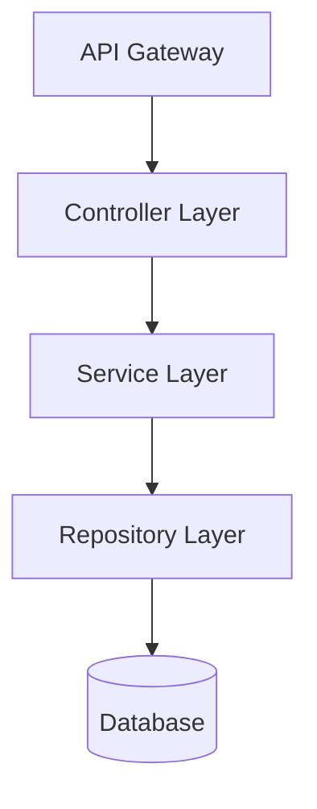
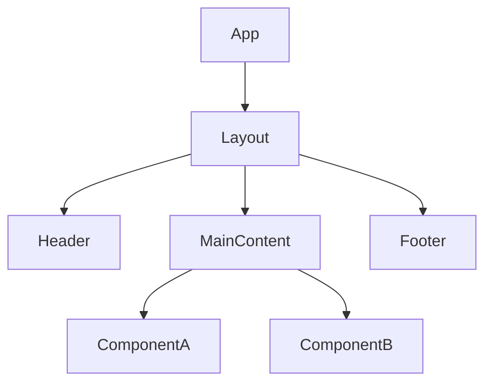
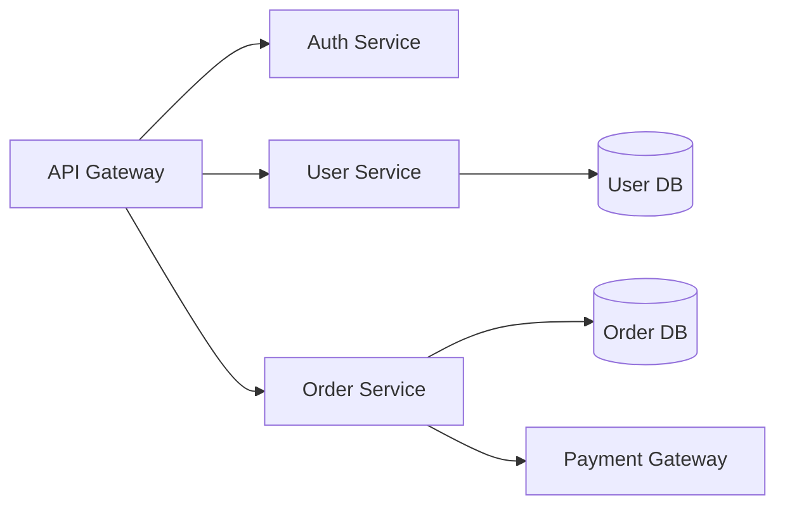
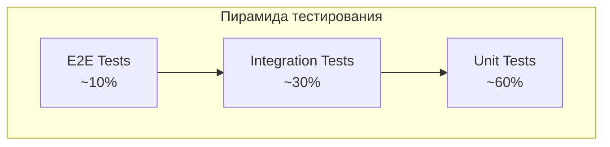

# Руководство по настройке

> 📖 **English version:** [Customization Guide](../customization-guide.md)

Это руководство объясняет, как редактировать шаблоны и правила cc-sdd для адаптации под рабочий процесс вашей команды.

## Введение

cc-sdd предоставляет две точки настройки:

- **templates/** - Определяют **структуру и формат** документов, генерируемых ИИ
- **rules/** - Определяют **критерии суждений и принципы генерации** для ИИ

Оба расположены в `{{KIRO_DIR}}/settings/` и используются во всём проекте.

---

## Два подхода к настройке

### 📄 templates/ - Настройка формата вывода

**Расположение**: `{{KIRO_DIR}}/settings/templates/specs/`

**Роль**: Определяет **структуру документа**, которую генерирует ИИ. Секции и поля, добавленные в шаблоны, будут автоматически заполняться ИИ.

**Файлы для редактирования**:
- `requirements.md` - Структура документа требований
- `design.md` - Структура документа дизайна
- `tasks.md` - Структура разбивки задач

**Примеры настройки**:
- Добавление секций в стиле PRD (Обзор продукта, Метрики успеха и т.д.)
- Добавление чек-листов согласования
- Добавление полей JIRA

---

### 📋 rules/ - Настройка критериев суждений ИИ

**Расположение**: `{{KIRO_DIR}}/settings/rules/`

**Роль**: Определяет **правила и принципы генерации** ИИ. Редактирование правил изменяет критерии суждений и стиль генерации ИИ.

**Файлы для редактирования**:
- `ears-format.md` - Правила описания требований в формате EARS
- `design-principles.md` - Принципы дизайна и стандарты документации
- `tasks-generation.md` - Правила гранулярности и структуры задач
- `tasks-parallel-analysis.md` - Критерии определения параллельного выполнения
- Другие (`design-discovery-*.md`, `gap-analysis.md` и т.д.)

**Примеры настройки**:
- Настройка гранулярности задач (1-3 часа → 4-8 часов и т.д.)
- Добавление принципов дизайна (безопасность, требования производительности и т.д.)
- Критерии определения приоритета требований

---

## 🚨 Структура, которую нужно сохранять

Команды cc-sdd читают и понимают документы через агентов ИИ. Следующие элементы **должны сохраняться**:

| Файл | Обязательные элементы | Причина |
|------|----------------------|---------|
| **requirements.md** | Нумерованные критерии (`1.`, `2.`, `3.`...) | ИИ распознаёт количество и структуру критериев |
| | Соответствие шаблону | ИИ учится структуре из шаблона |
| **design.md** | **Наличие файла** | Команды читают этот файл |
| **tasks.md** | Формат чекбоксов `- [ ] N.` | Движок выполнения задач распознаёт это |
| | Ссылки `_Требования: X, Y_` | Трассируемость требований |
| | Иерархическая структура (1, 1.1, 1.2...) | Анализ зависимостей |

**Важно**: Заголовки в requirements.md можно свободно менять. ИИ учится структурному паттерну, определённому в шаблоне, и генерирует по тому же паттерну.

### ✅ Гибкость requirements.md (Важно)

requirements.md очень гибок для настройки:

#### 1. Настройка имён заголовков

**Имена заголовков можно свободно менять**. ИИ учится структуре из шаблона:

- ✅ **Английский**: `### Requirement 1:` / `#### Acceptance Criteria`
- ✅ **Русский**: `### Требование 1:` / `#### Критерии приёмки`
- ✅ **Пользовательский**: `### REQ-1:` / `#### Критерии верификации`

**Ключевые моменты**:
- Сохраняйте паттерн нумерации (`N:` где N — число)
- Сохраняйте иерархию (`###` и `####`)
- Сохраняйте согласованность между шаблоном и генерируемыми файлами

#### 2. Формат описания критериев приёмки

**Формат EARS рекомендуется, но не обязателен**:

- ✅ **Формат EARS (рекомендуется)**: `WHEN [событие] THEN [система] SHALL [действие]`
- ✅ **Другие форматы допустимы**:
  - Простой формат: `Система отвечает на XX`
  - Формат BDD: `GIVEN [контекст] WHEN [событие] THEN [результат]`
  - Пользовательский формат: Собственный шаблон команды
- ✅ **Нумерация важна**: Содержимое свободно, пока сохраняется формат `1.`, `2.`, `3.`

**Преимущества формата EARS**:
- Высокая тестируемость (чёткие условия и ожидаемые результаты)
- Легко для понимания ИИ (улучшает точность генерации design/tasks)
- Отраслевой стандарт (легко читать ревьюерам)

### ✅ Гибкость design.md (Важно)

**design.md практически не имеет ограничений по содержимому**. Вы можете свободно настраивать его под процесс ревью вашей команды:

- ✅ **Имена заголовков свободны**: `## Архитектура`, `## Проектирование системы`, `## Технический дизайн`
- ✅ **Порядок заголовков тоже свободен**: Разместите трассируемость требований сверху, модель данных рядом с архитектурой
- ✅ **Добавление/удаление секций**: Добавьте элементы ревью команды, удалите ненужные секции
- ✅ **Изменение формата**: Таблицы, маркированные списки, диаграммы — свободный выбор

**Обязательно только наличие файла**: Команды читают `design.md`, но не парсят конкретные заголовки или форматы.

---

## Процедура настройки (3 шага)

### Шаг 1: Проверьте шаблоны по умолчанию

```bash
# Проверьте расположение шаблонов
ls -la {{KIRO_DIR}}/settings/templates/specs/
ls -la {{KIRO_DIR}}/settings/rules/
```

### Шаг 2: Добавьте/отредактируйте, сохраняя структуру

- **templates/**: Добавьте секции и поля
- **rules/**: Добавьте принципы и критерии

### Шаг 3: Проверьте тестовым выполнением

```bash
# Тест с новой спецификацией
/kiro:spec-init Тестовая функция настройки
/kiro:spec-requirements test-customization
/kiro:spec-design test-customization
/kiro:spec-tasks test-customization

# Проверьте сгенерированные файлы
cat {{KIRO_DIR}}/specs/test-customization/requirements.md
cat {{KIRO_DIR}}/specs/test-customization/design.md
cat {{KIRO_DIR}}/specs/test-customization/tasks.md
```

---

## Практические сценарии

Представляем 7 репрезентативных сценариев настройки под потребности команды.

---

## Сценарий 1: Требования в стиле PRD

### 📋 Цель настройки

- **templates**: `{{KIRO_DIR}}/settings/templates/specs/requirements.md`
- **rules**: `{{KIRO_DIR}}/settings/rules/ears-format.md` (опционально)

### 🎯 Случаи использования

- Продуктовые/бизнес-команды участвуют как стейкхолдеры
- Бизнес-контекст, приоритет и метрики успеха обязательны в ревью требований
- Много не-инженерных ревьюеров

### 🔧 Шаги настройки

#### Шаг 1: Редактирование шаблона (Обязательно)

**Файл для редактирования**: `{{KIRO_DIR}}/settings/templates/specs/requirements.md`

**🔒 Структура для сохранения**:
- Нумерованный паттерн заголовков (например, `### Требование N:`)
- Заголовок секции критериев (например, `#### Критерии приёмки`)
- Нумерованные критерии (`1.`, `2.`, `3.`...)

**➕ Добавьте следующие секции**:

```markdown
# Документ требований

## Контекст продукта

**Постановка проблемы**: {{PROBLEM_DESCRIPTION}}

**Целевые пользователи**: {{TARGET_USERS}}

**Метрики успеха**: {{SUCCESS_METRICS}}

**Сроки**: {{TIMELINE}}

**Бизнес-влияние**: {{BUSINESS_IMPACT}}

---

## Требования

### Требование 1: {{REQUIREMENT_AREA_1}}

**Цель**: Как {{ROLE}}, я хочу {{CAPABILITY}}, чтобы {{BENEFIT}}

**Бизнес-приоритет**: P0 (Критический) / P1 (Высокий) / P2 (Средний)

**Зависимости**: {{DEPENDENCIES}}

**Уровень риска**: Низкий / Средний / Высокий

#### Критерии приёмки

1. WHEN {{EVENT}} THEN система SHALL {{RESPONSE}}
2. IF {{CONDITION}} THEN система SHALL {{RESPONSE}}

**Метод верификации**: {{TEST_TYPE}}

**Порог успеха**: {{THRESHOLD}}

---

## Нефункциональные требования

### Требование NFR-1: Производительность

**Цель**: Отзывчивость и масштабируемость системы

#### Критерии приёмки

1. WHEN страница загружается THEN система SHALL отвечать в течение 2 секунд
2. WHEN API вызывается THEN система SHALL отвечать в течение 200мс

**Метод верификации**: Нагрузочное тестирование

**Порог успеха**: 95-й перцентиль < 200мс

---

## Соответствие и согласования

**Чек-лист ревью**:
- [ ] Команда продукта проверила
- [ ] Бизнес-стейкхолдер одобрил
- [ ] Юридическая/Compliance проверка
- [ ] Команда безопасности одобрила
```

### ✅ Поведение после завершения

При запуске `/kiro:spec-requirements my-feature`:

1. Секция **Контекст продукта** генерируется автоматически
2. Каждое требование включает **Бизнес-приоритет**, **Зависимости**, **Уровень риска**
3. **Метод верификации** и **Порог успеха** добавляются к каждому требованию
4. Секция **Нефункциональные требования** генерируется автоматически
5. Чек-лист **Соответствие и согласования** добавляется

---

## Сценарий 2: Дизайн-документ для Backend/API

### 📋 Цель настройки

- **templates**: `{{KIRO_DIR}}/settings/templates/specs/design.md`
- **rules**: `{{KIRO_DIR}}/settings/rules/design-principles.md` (опционально)

### 🎯 Случаи использования

- Разработка REST/GraphQL API
- Микросервисная архитектура
- Проектирование базы данных и определение схемы важны

### 🔧 Добавьте следующие секции

```markdown
## Спецификация API

### Базовая конфигурация

**Базовый URL**: `{{BASE_URL}}`

**Версия API**: `v{{VERSION}}`

**Аутентификация**: Bearer token (JWT) / API Key / OAuth 2.0

**Ограничение частоты**: {{RATE_LIMIT}} запросов в {{TIME_WINDOW}}

---

### Эндпоинты

#### POST /api/v1/{{resource}}

**Описание**: {{ENDPOINT_DESCRIPTION}}

**Аутентификация**: Обязательна

**Заголовки запроса**:
```http
Authorization: Bearer {{token}}
Content-Type: application/json
```

**Тело запроса**:
```json
{
  "field1": "string",
  "field2": 123
}
```

**Ответ (200 OK)**:
```json
{
  "data": {
    "id": "uuid",
    "field1": "string"
  }
}
```

---

## Схема базы данных

### Таблицы

#### {{table_name}}

**Схема**:
```sql
CREATE TABLE {{table_name}} (
  id UUID PRIMARY KEY DEFAULT gen_random_uuid(),
  field1 VARCHAR(255) NOT NULL,
  created_at TIMESTAMP WITH TIME ZONE NOT NULL DEFAULT NOW()
);
```

**Индексы**:
```sql
CREATE INDEX idx_{{table_name}}_field1 ON {{table_name}} (field1);
```

---

## Архитектура сервисов



**Ответственности слоёв**:
- **Controller**: Валидация запроса, форматирование ответа
- **Service**: Бизнес-логика, управление транзакциями
- **Repository**: Доступ к данным, построение запросов
```

---

## Сценарий 3: Фронтенд/UI-ориентированный дизайн

### 📋 Цель настройки

- **templates**: `{{KIRO_DIR}}/settings/templates/specs/design.md`

### 🎯 Случаи использования

- Разработка React/Vue/Angular
- Фокус на компоненты
- Интеграция с дизайн-системой

### 🔧 Добавьте следующие секции

```markdown
## Обзор UI

### Дизайн-система

**Используемая система**: {{DESIGN_SYSTEM_NAME}}

**Цветовая палитра**:
- Основной: `{{PRIMARY_COLOR}}`
- Вторичный: `{{SECONDARY_COLOR}}`
- Фоновый: `{{BACKGROUND_COLOR}}`

**Типографика**:
- Заголовки: {{HEADING_FONT}}
- Основной текст: {{BODY_FONT}}

---

## Иерархия компонентов



---

## Спецификации компонентов

### {{ComponentName}}

**Назначение**: {{PURPOSE}}

**Props**:
| Имя | Тип | Обязателен | По умолчанию | Описание |
|-----|-----|------------|--------------|----------|
| prop1 | string | Да | - | {{DESCRIPTION}} |
| prop2 | boolean | Нет | false | {{DESCRIPTION}} |

**Состояния**: Default, Hover, Active, Disabled, Loading, Error

**Доступность**:
- Роль ARIA: `{{ARIA_ROLE}}`
- Навигация с клавиатуры: Поддерживается
- Контрастный коэффициент: >= 4.5:1
```

---

## Сценарий 4: Интеграция с JIRA/Linear

### 📋 Цель настройки

- **templates**: `{{KIRO_DIR}}/settings/templates/specs/tasks.md`

### 🎯 Случаи использования

- Перенос задач в JIRA/Linear
- Отслеживание с метками и приоритетами
- Необходимость оценки времени

### 🔧 Измените формат задач

```markdown
# Задачи реализации

## P0 — Блокирующие задачи

### Задача 1: {{TASK_TITLE}}

**JIRA ID**: {{PROJECT_KEY}}-{{ISSUE_NUMBER}}

**Тип**: Story / Task / Bug / Epic

**Приоритет**: Highest / High / Medium / Low

**Оценка**: {{STORY_POINTS}} story points ({{TIME_ESTIMATE}} часов)

**Метки**: `backend`, `api`, `security`, `p0`

**Спринт**: Sprint {{SPRINT_NUMBER}}

**Исполнитель**: {{ASSIGNEE}}

**Зависимости**: Блокирует {{BLOCKED_TASKS}} / Блокируется {{BLOCKING_TASKS}}

#### Подзадачи

- [ ] 1.1 {{SUBTASK_1}}
  - _Требования: 1, 2_
  - _Оценка: 2 часа_
  
- [ ] 1.2 {{SUBTASK_2}}
  - _Требования: 3_
  - _Оценка: 3 часа_

#### Критерии приёмки

1. {{AC_1}}
2. {{AC_2}}

---

## P1 — Параллельные задачи

### Задача 2: {{TASK_TITLE}}
...
```

---

## Сценарий 5: Безопасность и Compliance

### 📋 Цель настройки

- **templates**: `{{KIRO_DIR}}/settings/templates/specs/design.md`
- **rules**: `{{KIRO_DIR}}/settings/rules/design-principles.md`

### 🎯 Случаи использования

- Аудит безопасности обязателен перед началом разработки
- Соответствие GDPR/HIPAA/SOC2
- Моделирование угроз в дизайне

### 🔧 Добавьте секцию безопасности

```markdown
## Ревью безопасности

### Классификация данных

| Тип данных | Чувствительность | Шифрование | Хранение |
|-----------|-----------------|------------|----------|
| PII (личные данные) | Высокая | AES-256 | Зашифрованная БД |
| Финансовые данные | Критическая | AES-256 + HSM | Изолированная зона |

### Модель угроз

| Угроза | Вероятность | Влияние | Смягчение |
|--------|-------------|---------|----------|
| SQL Injection | Средняя | Критическое | Параметризованные запросы |
| XSS | Высокая | Высокое | Экранирование выхода |

### Аутентификация и авторизация

**Метод аутентификации**: OAuth 2.0 + MFA

**Модель авторизации**: RBAC

**Управление сессиями**:
- Тайм-аут: 30 минут неактивности
- Хранение токенов: HttpOnly Secure cookies
- Ротация токенов: При каждом обновлении

### Чек-лист соответствия

- [ ] Соответствие GDPR
- [ ] Обработка персональных данных задокументирована
- [ ] Шифрование данных в покое и при передаче
- [ ] Журналирование аудита внедрено
```

---

## Сценарий 6: Микросервисы и интеграции

### 📋 Цель настройки

- **templates**: `{{KIRO_DIR}}/settings/templates/specs/design.md`

### 🔧 Добавьте секции интеграции

```markdown
## Карта сервисов



### Контракты сервисов

#### {{ServiceName}} API

**Базовый URL**: `http://{{service}}.internal:{{port}}`

**Мониторинг**: Prometheus + Grafana

**Трассировка**: Jaeger/Zipkin

### Обработка ошибок

**Паттерн Circuit Breaker**:
- Порог: 5 последовательных ошибок
- Тайм-аут: 30 секунд
- Half-open после: 60 секунд
```

---

## Сценарий 7: Тестовая стратегия

### 📋 Цель настройки

- **templates**: `{{KIRO_DIR}}/settings/templates/specs/design.md`
- **rules**: `{{KIRO_DIR}}/settings/rules/tasks-generation.md`

### 🔧 Добавьте секцию тестирования

```markdown
## Стратегия тестирования

### Требования к покрытию

| Слой | Минимальное покрытие | Типы тестов |
|------|---------------------|-------------|
| Unit | 80% | Jest/Vitest |
| Integration | 60% | Supertest |
| E2E | Критические пути | Playwright |

### Пирамида тестирования



### Тестовые приоритеты

**P0 (Обязательно)**:
- Тесты аутентификации
- Защита критических данных
- Основные бизнес-потоки

**P1 (Должно быть)**:
- Edge cases
- Обработка ошибок

**P2 (Хорошо бы)**:
- Производительность
- Нагрузочные тесты
```

---

## Устранение неполадок

### Общие проблемы

| Проблема | Причина | Решение |
|----------|---------|---------|
| Шаблон не применяется | Синтаксическая ошибка в шаблоне | Проверьте формат Markdown |
| Секции отсутствуют | Неполный шаблон | Добавьте недостающие секции |
| ИИ игнорирует правила | Правила не загружены | Проверьте путь к файлам rules/ |

### Отладка

```bash
# Проверьте загрузку шаблонов
ls -la {{KIRO_DIR}}/settings/templates/specs/

# Проверьте правила
ls -la {{KIRO_DIR}}/settings/rules/

# Проверьте синтаксис Markdown
cat {{KIRO_DIR}}/settings/templates/specs/requirements.md
```

---

## Связанные ресурсы

- [Справочник команд](command-reference.md)
- [Рабочий процесс разработки на основе спецификаций](spec-driven.md)
- [Руководство по миграции](migration-guide.md)
