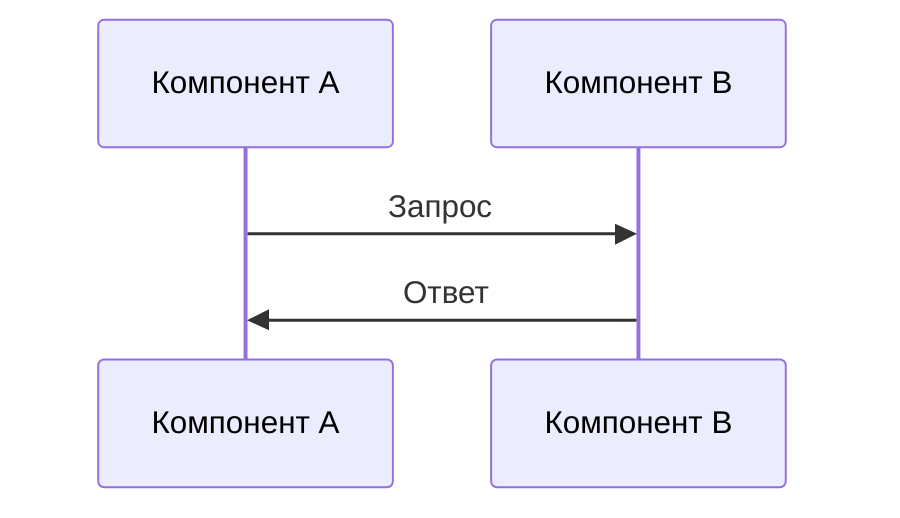

# Документ технического дизайна

## Обзор
**Функция**: {{FEATURE_NAME}}

[Краткое описание технического подхода к реализации функции]

## Паттерн архитектуры и карта границ

[Описание выбранного архитектурного паттерна и его определение границ]

```
[Диаграмма ASCII или Mermaid архитектуры]
```

## Стек технологий и согласование

### Выбранные технологии
| Компонент | Технология | Обоснование |
|-----------|------------|-------------|
| [Компонент] | [Технология] | [Почему выбрано] |

### Согласование с Steering
[Как выбор согласуется с существующими стандартами проекта]

## Компоненты и контракты интерфейсов

### [Компонент 1]
**Назначение**: [Для чего этот компонент]

**Интерфейс**:
```typescript
interface IComponentName {
  method(param: ParamType): ReturnType;
}
```

**Зависимости**: [Другие компоненты, от которых зависит]

### [Компонент 2]
**Назначение**: [Для чего этот компонент]

**Интерфейс**:
```typescript
interface IAnotherComponent {
  operation(input: InputType): OutputType;
}
```

## Потоки данных

[Описание потоков данных между компонентами]



## Обработка ошибок

| Тип ошибки | Обработка | Восстановление |
|------------|-----------|----------------|
| [Ошибка] | [Как обрабатывается] | [Стратегия восстановления] |

## Соображения безопасности

[Аспекты безопасности, которые нужно учесть в реализации]

## Трассируемость требований

| ID требования | Компонент(ы) | Покрытие |
|---------------|--------------|----------|
| 1.1 | [Компоненты] | [Как покрывается] |
| 1.2 | [Компоненты] | [Как покрывается] |

---
_Этот документ фокусируется на архитектуре и интерфейсах, не на коде реализации_
